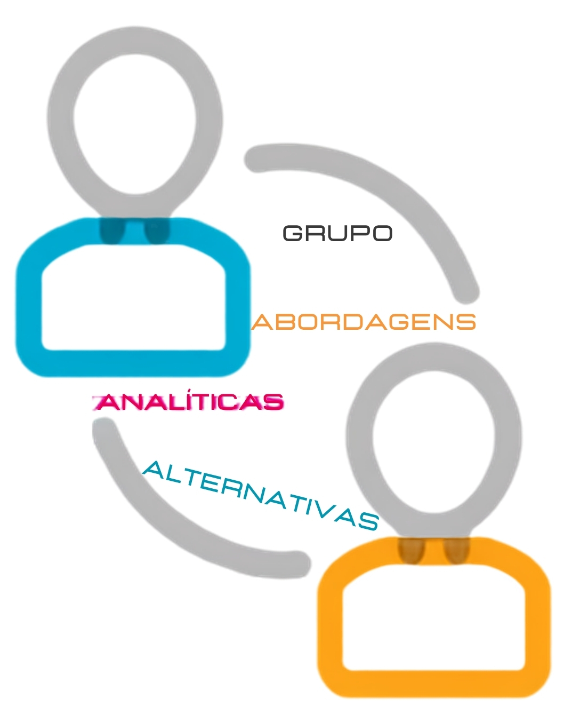
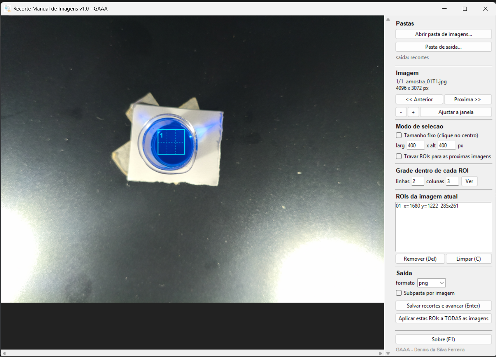
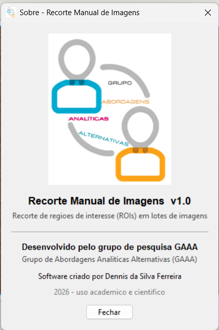

<div align="center">



# Recorte Manual de Imagens

**Ferramenta de janela para recortar regiões de interesse (ROIs) de lotes de imagens,
com coordenadas registradas em CSV para que o recorte seja reprodutível.**


Desenvolvido pelo grupo de pesquisa **GAAA** · Software criado por **Dennis da Silva Ferreira**

</div>

---

## O problema

Quando trabalhamos com imagens digitais em quimica analitica, cada fotografia de uma amostra precisa virar várias
sub-imagens recortadas na mesma região, com o mesmo tamanho, para que os histogramas de
cor sejam comparáveis entre amostras. Fazer isso à mão em um editor de imagens é lento,
inconsistente e o pior para um artigo **não é reprodutível**, ninguém consegue repetir
exatamente os mesmos recortes depois.

Este programa resolve os três pontos: a seleção é visual, o tamanho pode ser travado, e
**toda ROI aplicada é gravada em um CSV** que regenera os recortes idênticos a qualquer
momento, em qualquer computador.



## Recursos

| Recurso | Para que serve |
|---|---|
| **Seleção livre** | arrasta o retângulo sobre a região desejada em cada imagem |
| **Tamanho fixo** | define `largura × altura` em pixels e basta clicar no centro — todos os recortes saem idênticos, essencial para comparar histogramas |
| **ROIs travadas** | marca a região uma vez e reaproveita nas imagens seguintes (fotos de tripé/scanner) |
| **Grade dentro da ROI** | divide cada região em `linhas × colunas`, multiplicando as sub-amostras por foto |
| **Aplicar a todas** | processa a pasta inteira com as ROIs atuais, em um clique |
| **Resolução original** | o zoom é apenas visual; o recorte sai sempre na resolução da foto |
| **CSV de coordenadas** | `recortes_coords.csv` registra cada recorte e permite refazer tudo depois |
| **Correção de EXIF** | a orientação gravada pela câmera é aplicada antes do recorte |
| **Modo em lote / CLI** | o mesmo código roda sem janela, para pipelines e notebooks |

### Atalhos de teclado

| Tecla | Ação | Tecla | Ação |
|---|---|---|---|
| `Enter` | salva os recortes e avança | `Del` | remove a última ROI |
| `←` `→` | troca de imagem | `C` | limpa as ROIs |
| `+` `-` `0` | zoom (ou `Ctrl`+roda do mouse) | `T` | trava/destrava as ROIs |
| `F1` | janela "Sobre" | | |

## Baixar e usar (Windows)

1. Baixe o **[RecorteManual.exe](../../releases/latest)** (ou pegue em
   [`executavel/RecorteManual.exe`](executavel/RecorteManual.exe) neste repositório).
2. Duplo clique. **Não precisa instalar Python nem nada mais** — a logomarca, o ícone e
   todas as bibliotecas viajam dentro do executável (~18 MB).
3. `Abrir pasta de imagens...` → `Pasta de saída...` → desenhe as ROIs → `Enter`.

> **SmartScreen:** o executável não é assinado digitalmente (certificado de código é pago),
> então na primeira execução o Windows pode avisar *"O Windows protegeu o computador"*.
> Clique em **Mais informações → Executar assim mesmo**. O código-fonte completo está
> aqui no repositório para auditoria, e o `.exe` pode ser recompilado por qualquer pessoa
> com o comando da seção seguinte.

Quer testar sem ter imagens à mão? A pasta [`exemplos/imagens_demo/`](exemplos/imagens_demo)
traz três amostras sintéticas prontas para recortar.

## Usar como biblioteca Python

O mesmo arquivo é importável — é assim que ele entra em notebooks de análise:

```python
from pathlib import Path
import recorte_manual as rec

# 1) janela de seleção
rec.abrir_janela(Path('imagens/original'), Path('imagens/recorte'), 'jpg')

# 2) mesma ROI em toda a pasta, cada uma dividida em 2x3 sub-recortes
rec.aplicar_em_lote('imagens/original', 'imagens/recorte',
                    rois=[(300, 200, 600, 400)],
                    n_linhas=2, n_colunas=3, formato='png')

# 3) refazer exatamente os recortes de uma sessão anterior
rec.refazer_do_csv('imagens/recorte/recortes_coords.csv',
                   'imagens/original', 'recortes_refeitos', formato='png')
```

Ou pela linha de comando:

```powershell
python recorte_manual.py --entrada imagens --saida recortes --roi 300,200,600,400 --grade 2x3 --lote
python recorte_manual.py --entrada imagens --saida recortes2 --csv recortes/recortes_coords.csv
```

O notebook [`exemplos/Recorte_Manual_Imagens.ipynb`](exemplos/Recorte_Manual_Imagens.ipynb)
mostra o fluxo completo: abrir a janela, aplicar em lote, conferir os recortes em mosaico e
refazer tudo a partir do CSV.

## Compilar o executável

```powershell
pip install -r requirements.txt
pyinstaller RecorteManual.spec --noconfirm --clean
```

O resultado sai em `dist\RecorteManual.exe`. No Windows, `construir_exe.bat` faz os três
passos (dependências → ícone → compilação) com um duplo clique.

## Estrutura do repositório

```
recorte_manual.py        código do programa: núcleo, interface Tkinter e CLI
RecorteManual.spec       receita do PyInstaller (o que entra no executável)
versao_exe.txt           autoria/versão exibidas em Propriedades > Detalhes
construir_exe.bat        compila tudo em um passo
requirements.txt         Pillow (programa) + PyInstaller (compilação)
assets/                  logomarca do GAAA, ícone e o gerador do .ico
docs/                    capturas de tela usadas neste README
exemplos/                notebook de uso e imagens de demonstração
executavel/              RecorteManual.exe pronto para baixar
```

O arquivo `recorte_manual.py` é dividido em três blocos independentes: o **núcleo sem
interface** (recorte, grade, CSV), a **interface gráfica** e a **linha de comando**. O núcleo
não importa Tkinter, então roda igual em servidor, notebook ou dentro da janela.

## Sobre



**Desenvolvido pelo grupo de pesquisa GAAA**
Grupo de Abordagens Analíticas Alternativas

**Software criado por Dennis da Silva Ferreira**

Escrito para o tratamento de imagens em química analítica, e publicado aqui
para que outros grupos possam usar e para que os recortes de qualquer trabalho feito com
ele sejam reprodutíveis por terceiros.

<br clear="right">

## Licença

[MIT](LICENSE) — uso livre, inclusive comercial, mantendo o aviso de autoria.
Se este programa ajudar em um trabalho acadêmico, uma citação ao GAAA é bem-vinda.

---

<details>
<summary><b>English summary</b></summary>

**Manual Image Cropping** — a Tkinter + Pillow desktop tool for cropping regions of
interest (ROIs) from batches of images, built for colour-histogram analysis in analytical
chemistry.

Crops always come out at the original resolution, every ROI is logged to
`recortes_coords.csv`, and that CSV regenerates byte-identical crops later — which makes the
image preprocessing step of a paper reproducible by third parties. Supports free selection,
fixed-size selection, ROIs locked across images, and an `n × m` grid inside each ROI that
multiplies sub-samples per photograph. Ships as a single-file Windows executable (no Python
required) and doubles as an importable Python module for notebooks and batch pipelines.

Developed by the GAAA research group (Grupo de Abordagens Analíticas Alternativas).
Software created by Dennis da Silva Ferreira. MIT licensed.

</details>
